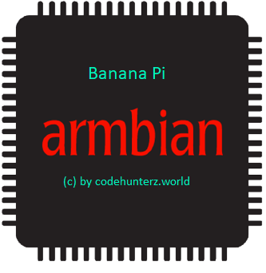
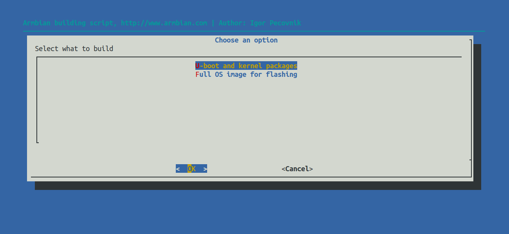

<h3 align=center><a href="#armbian-build-tools"></a><br>
build tools</h3>

<p align=right>&nbsp;</p>

[](https://github.com/armbian/build/actions?query=workflow%3ABuild)
[](https://twitter.com/intent/follow?screen_name=armbian)

## Table of contents

- [What this project does?](#what-this-project-does)
- [What do you need to get started?](#what-do-you-need-to-get-started)
- [How to build an image or a kernel?](#how-to-build-an-image-or-a-kernel)
- [Build parameter examples](#build-parameter-examples)
- [Compare with industry standards](#compare-with-industry-standards)
- [Where to download prebuilt images?](#where-to-download-prebuilt-images)
- [Additional information](#additional-information)
- [Build tools overview](#build-tools-overview)
- [Support](#support)
- [Contribute](#contribute)
- [Social](#social)
- [Credits](#credits)
- [Sponsors](#sponsors)

<p align=right>&nbsp;</p>


## What this project does?

- builds custom Debian based Linux system optimized for [supported single board computers](https://www.armbian.com/download/),
- covers root filesystem generation, kernel image compilation and bootloader compilation,
- maintains low-level control software for a [selection of hardware](https://www.armbian.com/download/),
- provides a consistent user experience by keeping system standards across different SBC platforms.

<p align=right>&nbsp;</p>

## What do you need to get started?
    
- x64 machine with at least 2GB of memory and ~35GB of disk space for the VM, container or native OS,
- Ubuntu Bionic 18.04 / Focal 20.04 x64 for native building or any [Docker](https://docs.armbian.com/Developer-Guide_Building-with-Docker/) capable x64 Linux for containerised,
- superuser rights (configured sudo or root access).

<p align=right><a href=#table-of-contents>⇧</a></p>

## How to build an image or a kernel?

```text
apt-get -y install git
git clone https://github.com/armbian/build
cd build
./compile.sh
```
<a href="#how-to-build-an-image-or-a-kernel"></a>
- The script will take care about preparing the workspace like installing necessary dependencies and downloading sources and tools.
- It guides through the process until either a kernel package set or a readyo-to-image for a sdcard is created.

<p align=right><a href=#table-of-contents>⇧</a></p>

## Build parameter examples

Show work in progress areas in interactive mode:

```text
./compile.sh EXPERT="yes"
```

Run build tools inside Docker container:

```text
./compile.sh docker
```

Build minimal CLI Debian buster based image for Odroid XU4. Use modern kernel and write image to the SD card:

```text
./compile.sh BOARD="odroidxu4" BRANCH="current" RELEASE="buster" CARD_DEVICE="/dev/sda" \
KERNEL_ONLY="no" KERNEL_CONFIGURE="no" BUILD_DESKTOP="no" BUILD_MINIMAL="yes"
```

[Build parameters, advanced build options, user defined configuration, build with Docker?](#additional-information)

<p align=right><a href=#table-of-contents>⇧</a></p>

## Compare with industry standards

Check similarity, advantages and disadvantages compared with leading industry standard build software.

Function | Armbian | Yocto | Buildroot |
|:--|:--|:--|:--|
| Target | general purpose | embedded | embedded / IOT | 
| U-boot and kernel | compiled from sources | compiled from sources | compiled from sources |
| Board support maintenance &nbsp; | complete | outside | outside | 
| Root file system | Debian or Ubuntu based| custom | custom |
| Package manager | APT | any | none |
| Configurability | limited | large | large |
| Initramfs support | yes | yes | yes |
| Getting started | quick | very slow | slow |
| Cross compilation | yes | yes | yes |

<p align=right><a href=#table-of-contents>⇧</a></p>

## Where to download prebuilt images?

https://www.armbian.com/download/

Armbian [releases](https://docs.armbian.com/Release_Changelog/) quarterly at the end of [February, May, August, November](https://github.com/armbian/documentation/blob/master/docs/Process_Release-Model.md). You are welcome to propose changes to our default [images build list](https://github.com/armbian/build/blob/master/config/targets.conf).


<p align=right><a href=#table-of-contents>⇧</a></p>

## Additional information

- [Build parameters and advanced build options](https://docs.armbian.com/Developer-Guide_Build-Options/),
- [Make use of user defined configurations](https://docs.armbian.com/Developer-Guide_User-Configurations/),
- [Docker](https://docs.armbian.com/Developer-Guide_Building-with-Docker/) and [Vagrant](https://docs.armbian.com/Developer-Guide_Using-Vagrant/) building guides,
- Engage in [Armbian build framework forums](https://forum.armbian.com/forum/4-development/),
- Check [Jira project management application](https://armbian.atlassian.net/browse/AR) status,
- Make use of [central project search engine](https://www.armbian.com/search),
- Browse [IRC channel logs](http://irc.armbian.com) or interact at #armbian on [freenode](https://freenode.net/).

<p align=right><a href=#table-of-contents>⇧</a></p>

## Build tools overview

```text
├── cache                                Work / cache directory
│   ├── rootfs                           Compressed vanilla Debian and Ubuntu rootfilesystem cache
│   ├── sources                          Kernel, u-boot and various drivers sources. Mainly C code
│   ├── toolchains                       External cross compilers from Linaro™ or ARM™
├── config                               Packages repository configurations
│   ├── targets.conf                     Board build target configuration
│   ├── boards                           Board configurations
│   ├── bootenv                          Initial boot loaders environments per family
│   ├── bootscripts                      Initial Boot loaders scripts per family
│   ├── kernel                           Kernel build configurations per family
│   ├── sources                          Kernel and u-boot sources locations and scripts
│   ├── templates                        User configuration templates which populate userpatches
│   └── torrents                         External compiler and rootfs cache torrents
├── lib                                  Main build tools libraries
├── output                               Build artifact
│   └── deb                              Deb packages
│   └── images                           Bootable images - RAW or compressed
│   └── debug                            Patch and build logs
│   └── config                           Kernel configuration export location
│   └── patch                            Created patches location
├── packages                             Support scripts, binary blobs, packages
│   ├── blobs                            Wallpapers, various configs, closed source bootloaders
│   ├── bsp                              Scripts and configs overlay for rootfs
│   └── extras-buildpkgs                 Optional compilation and packaging engine
├── patch                                Collection of patches
│   ├── atf                              ARM trusted firmware
│   ├── kernel                           Linux kernel patches
|   |   └── family-branch                Per kernel family and branch
│   ├── misc                             Linux kernel packaging patches
│   └── u-boot                           Universal boot loader patches
|       ├── u-boot-board                 For specific board
|       └── u-boot-family                For entire kernel family
└── userpatches                          User: configuration patching area
    ├── lib.config                       User: tools common config/override file
    ├── config-default.conf              User: default user config file
    ├── customize-image.sh               User: script will execute just before closing the image
    ├── atf                              User: ARM trusted firmware
    ├── kernel                           User: Linux kernel per kernel family
    ├── misc                             User: various
    └── u-boot                           User: universal boot loader patches
```

<p align=right><a href=#table-of-contents>⇧</a></p>

## Support

- Have you found a bug in the **build tools**? 

    Try to recreate it with a clean build tools clone. Then search for [existing and closed issues](https://github.com/armbian/build/issues). If you don't find it there, [open a new issue](https://github.com/armbian/build/issues/new).
    
- Do you have troubles **elsewhere**? 
    
    Armbian is free software and provides **best effort help** through [community forums](https://forum.armbian.com/). If you can't find answer there and/or with help of [general project search engine](https://www.armbian.com/search) and [documentation](https://docs.armbian.com), consider [hiring an expert](https://www.debian.org/consultants/).

- Personalised support?

    It is limited to active project supporters and sponsors. The shortest way to become one and receive our attention is a four figure [donation to our non-profit project](https://www.armbian.com/donate).

<p align=right><a href=#table-of-contents>⇧</a></p>

## Contribute

- Adding a new feature? 

    You are welcome to suggest or contribute directly to the code with a pull request. In case your proposed changes are large, remember to discuss them prior to development.

- Join development? 

    Join regulars on their active missions, start maintaining any part of the code: patches, drivers or scripted applications like [armbian-config](https://github.com/armbian/config), address [community wishes](https://github.com/armbian/build/issues),

- Help elsewhere?

    Maintain and develop [documentation](https://github.com/armbian/documentation), [CI](https://github.com/armbian/ci-testing-tools), [autotests](https://github.com/armbian/autotests), [seed torrents](https://forum.armbian.com/topic/4198-seed-our-torrents/), help on [forum moderating](https://forum.armbian.com/topic/12631-help-on-forum-moderating/), [project administration](https://forum.armbian.com/forum/39-armbian-project-administration/), [costs](https://www.armbian.com/donate).

<p align=right><a href=#table-of-contents>⇧</a></p>

## Social

- [Participate in Armbian forums](https://forum.armbian.com),
- Chat with fellow users on IRC [#armbian](https://webchat.freenode.net/?channels=armbian) on Freenode,
- Follow [@armbian on Twitter](https://twitter.com/armbian) or [LinkedIN](https://www.linkedin.com/company/armbian).

<p align=right><a href=#table-of-contents>⇧</a></p>

## Credits

- [Current and past contributors](https://github.com/armbian/build/graphs/contributors), our families and friends,
- [Support staff that keeps forums usable](https://forum.armbian.com/members/2-moderators/),
- [Individuals that help with their ideas](https://forum.armbian.com/), reports and [donations](https://www.armbian.com/donate).

<p align=right><a href=#table-of-contents>⇧</a></p>

## Sponsors

Most of the project is sponsored with a work done by volunteer collaborators, while some part of the project costs are being covered by the industry. We would not be able to get this far without their help. 

[Do you want to see yourself below?](https://www.armbian.com/#contact)

<a href="https://www.armbian.com/download/?tx_maker=xunlong" target="_blank"></a><a href="https://www.armbian.com/download/?tx_maker=friendlyelec" target="_blank"></a><a href="https://k-space.ee" target="_blank"></a><a href="https://www.innoscale.net" target="_blank"></a><a href="https://www.armbian.com/download/?tx_maker=olimex" target="_blank"></a><a href="https://www.armbian.com/download/?tx_maker=kobol" target="_blank"></a>

<p align=right><a href=#table-of-contents>⇧</a></p>
