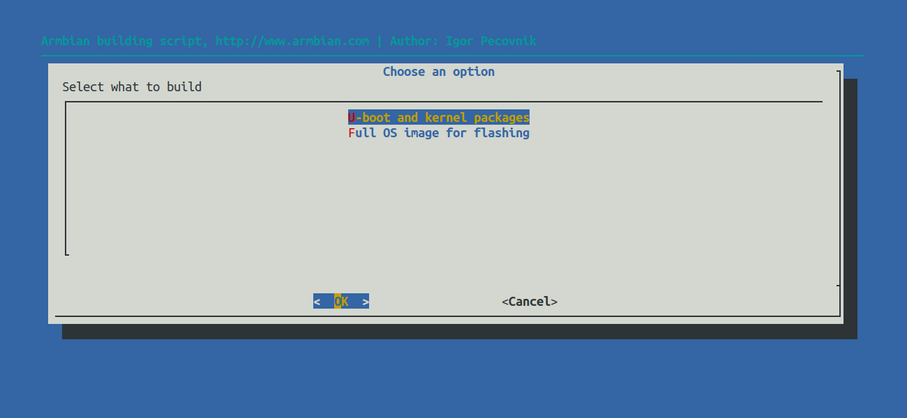

<h3 align="center">
  <a href=#></a>
  <br><br>
</h3>

## Purpose of This Repository

The **Armbian Linux Build Framework** creates customizable OS images based on **Debian** or **Ubuntu** for **single-board computers (SBCs)** and embedded devices.

It builds a complete Linux system including kernel, bootloader, and root filesystem, giving you control over versions, configuration, firmware, device trees, and system optimizations.

The framework supports **native**, **cross**, and **containerized** builds for multiple architectures (`x86_64`, `aarch64`, `armhf`, `riscv64`) and is suitable for development, testing, production, or automation.

> **Looking for prebuilt images?** Use [Armbian Imager](https://github.com/armbian/imager/releases) — the easiest way to download and flash Armbian to your SD card or USB drive. Available for Linux, macOS, and Windows.

## Quick Start

```bash
git clone https://github.com/armbian/build
cd build
./compile.sh
```

<a href="#how-to-build-an-image-or-a-kernel"></a>

The entrypoint `compile.sh` sources the build framework under `lib/` and dispatches to the requested target (e.g. `kernel`, `build`, `requirements`). Build configuration is controlled by variables passed on the command line or through configuration files — never by editing `compile.sh` itself.

## Build Host Requirements

### Hardware
- **RAM:** ≥8GB (less with `KERNEL_BTF=no`)
- **Disk:** ~50GB free space
- **Architecture:** x86_64, aarch64, or riscv64

### Operating System
- **Native builds:** Armbian or Ubuntu 24.04 (Noble)
- **Containerized:** Any Docker-capable Linux
- **Windows:** WSL2 with Armbian/Ubuntu 24.04

### Software
- Superuser privileges (`sudo` or root)
- Up-to-date system (outdated Docker or other tools can cause failures)

## Repository Layout

| Path | Contents |
|:--|:--|
| `compile.sh` | Top-level entrypoint; sources `lib/single.sh` and calls `cli_entrypoint`. |
| `lib/` | Bash build framework: CLI dispatch, functions, hooks, tool wrappers. |
| `config/boards/` | Per-board configuration files (`*.conf`, `*.csc`, `*.wip`, `*.eos`, `*.tvb`). See [`config/boards/README.md`](config/boards/README.md) for the variable reference. |
| `config/sources/` | SoC family / arch definitions. See [`config/sources/README.md`](config/sources/README.md). |
| `config/bootenv/`, `config/bootscripts/` | U-Boot environment fragments and boot script templates. |
| `config/cli/`, `config/desktop/`, `config/distributions/` | Userspace package sets and distro/status metadata. |
| `config/kernel/` | Per-family kernel `.config` files. |
| `patch/` | Kernel, U-Boot and firmware patches, organized per family and version (e.g. `patch/u-boot/v2026.07-sunxi/`, `patch/kernel/archive/rockchip64-6.18/`). |
| `packages/` | Armbian-specific packaging: kernel deb scripts, BSP, blobs, extras. See [`packages/README.md`](packages/README.md). |
| `extensions/` | Optional build-time extensions (enabled via `ENABLE_EXTENSIONS=`). |
| `tools/` | Helper scripts (patch formatting, kernel config unification). See [`tools/README.md`](tools/README.md). |
| `action.yml` | Composite GitHub Action wrapping the build for use in CI. |
| `.github/workflows/` | Maintenance, data-sync, mirroring and dispatch workflows (see below). |

### Board configuration status

Board configs live in `config/boards/` and their file extension encodes support status:

| Ext | Meaning |
|:--|:--|
| `.conf` | Supported |
| `.csc` | Community / work in progress / old-stable |
| `.wip` | Work in progress |
| `.eos` | End of life |
| `.tvb` | TV box |

See [`config/distributions/README.md`](config/distributions/README.md) for the equivalent status model applied to upstream Debian/Ubuntu releases.

## Built With

- **Bash** — the entire build framework and CLI (`compile.sh`, everything under `lib/`, most of `.github/workflows/*`) is Bash 4+, with `set -e -o errtrace -o errexit`.
- **Python 3** — used by asset/manifest generation in `action.yml` and by various maintenance workflows.
- Standard Linux toolchain expected on the host: `git`, `curl`, `jq`, `rsync`, `gpg`, `make`, cross toolchains, Docker (for containerized builds), etc. Run `./compile.sh requirements` to install host dependencies.

## GitHub Action

This repo publishes a composite action (`action.yml`, `name: "Rebuild Armbian"`) so downstream workflows can build Armbian images or kernels. Notable inputs:

| Input | Default | Purpose |
|:--|:--|:--|
| `armbian_target` | `kernel` | `compile.sh` target (e.g. `kernel`, `build`) |
| `armbian_board` | `uefi-x86` | Board slug from `config/boards/` |
| `armbian_kernel_branch` | `current` | `legacy` / `current` / `edge` / branch name |
| `armbian_release` | `noble` | Userspace release |
| `armbian_ui` | `minimal` | `minimal`, `server`, or a desktop environment |
| `armbian_compress` | `sha,img,xz` | Output compression / checksum method |
| `armbian_extensions` | *(empty)* | Space-separated list for `ENABLE_EXTENSIONS` |
| `armbian_pgp_key` / `armbian_pgp_password` | — | Optional image signing |
| `armbian_download_base_url` | `https://dl.armbian.com` | Base URL for the generated assets manifest |
| `armbian_index_url` | `https://github.armbian.com/armbian-images.json` | Index used to enrich manifest entries |

The action checks out `armbian/os` and `armbian/build`, applies user patches, then runs `./compile.sh requirements` followed by the requested build with the resolved variables.

## CI Workflows

Workflows in `.github/workflows/` are grouped by prefix:

- **`data-*`** — sync labels, maintainers (from the Armbian contacts DB), board list, Jira tickets, and tool versions (Shellcheck, shfmt, ORAS, bat).
- **`maintenance-*`** — auto-labeling, PR/merge announcements to Discord, artifact matrix builds (`maintenance-build-artifacts.yml`, gated by the `Release manager` team), board asset validation against [`armbian/armbian.github.io`](https://github.com/armbian/armbian.github.io), kernel security option analysis via [`kconfig-hardened-check`](https://github.com/a13xp0p0v/kconfig-hardened-check), board-config validation, script linting, kernel patch/config rewrites, security scans, log cleanup, and welcome messages.
- **`infrastructure-*`** — mirror `main` to Codeberg and forward events to forks (`ARMBIAN_SELF_DISPATCH_TOKEN`).
- **`dependency-review.yml`** — vulnerability review on PRs.

Self-hosted runner setup and the forked-dispatch flow are documented in [`.github/workflows/README.md`](.github/workflows/README.md).

## Resources

- **[Documentation](https://docs.armbian.com/Developer-Guide_Overview/)** — Comprehensive guides for building, configuring, and customizing
- **[Website](https://www.armbian.com)** — News, features, and board information
- **[Blog](https://blog.armbian.com)** — Development updates and technical articles
- **[Forums](https://forum.armbian.com)** — Community support and discussions

## Contributing

We welcome contributions! See [CONTRIBUTING.md](CONTRIBUTING.md) for guidelines on reporting issues, submitting changes, and contributing code. New boards must also ship the required images/logos in [`armbian/armbian.github.io`](https://github.com/armbian/armbian.github.io) — this is enforced by `maintenance-check-board-assets.yml`.

## Support

### Community Forums
Get help from users and contributors on troubleshooting, configuration, and development.
👉 [forum.armbian.com](https://forum.armbian.com)

### Real-time Chat
Join discussions with developers and community members on IRC or Discord.
👉 [Community Chat](https://docs.armbian.com/Community_IRC/)

### Paid Consultation
For commercial projects, guaranteed response times, or advanced needs, paid support is available from Armbian maintainers.
👉 [Contact us](https://www.armbian.com/contact)

## License

Distributed under the **GNU General Public License v2.0**. See [LICENSE](LICENSE) for the full text, and [CREDITS.md](CREDITS.md) for authors.

## Contributors

Thank you to everyone who has contributed to Armbian!

<a href="https://github.com/armbian/build/graphs/contributors">
  
</a>

## Armbian Partners

Our [partnership program](https://forum.armbian.com/subscriptions) supports Armbian's development and community. Learn more about [our Partners](https://armbian.com/partners).
