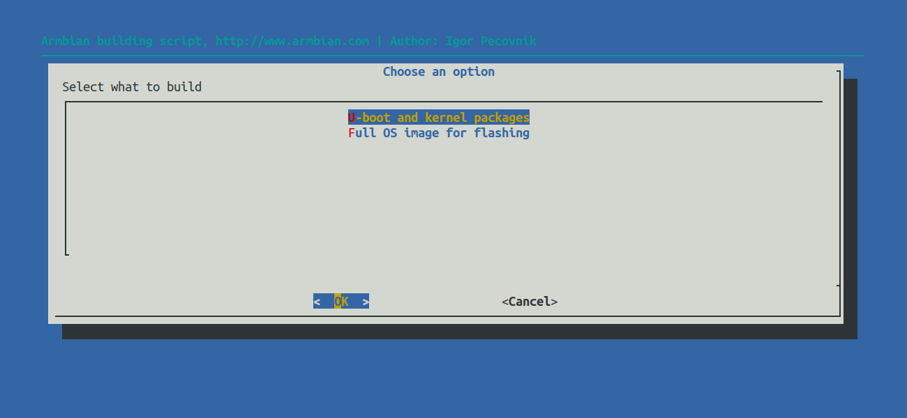

<h3 align="center">
  <a href=#></a>
  <br><br>
</h3>

## Purpose of This Repository

The **Armbian Linux Build Framework** creates customizable OS images based on **Debian** or **Ubuntu** for **single-board computers (SBCs)** and embedded devices.

It builds a complete Linux system including kernel, bootloader, and root filesystem, giving you control over versions, configuration, firmware, device trees, and system optimizations.

The framework supports **native**, **cross**, and **containerized** builds for multiple architectures (`x86_64`, `aarch64`, `armhf`, `riscv64`) and is suitable for development, testing, production, or automation.

> **Looking for prebuilt images?** Use [Armbian Imager](https://github.com/armbian/imager/releases) — the easiest way to download and flash Armbian to your SD card or USB drive. Available for Linux, macOS, and Windows.

## Quick Start

```bash
git clone https://github.com/armbian/build
cd build
./compile.sh
```

<a href="#how-to-build-an-image-or-a-kernel"></a>

## Build Host Requirements

### Hardware
- **RAM:** ≥8GB (less with `KERNEL_BTF=no`)
- **Disk:** ~50GB free space
- **Architecture:** x86_64, aarch64, or riscv64

### Operating System
- **Native builds:** Armbian/Debian 13 (Trixie)
- **Containerized:** Any Docker-capable Linux
- **Windows:** WSL2 with Armbian/Debian 13 (Trixie)

### Software
- Superuser privileges (`sudo` or root)
- Up-to-date system (outdated Docker or other tools can cause failures)

## Resources

- **[Documentation](https://docs.armbian.com/Developer-Guide_Overview/)** — Comprehensive guides for building, configuring, and customizing
- **[Website](https://www.armbian.com)** — News, features, and board information
- **[Blog](https://blog.armbian.com)** — Development updates and technical articles
- **[Forums](https://forum.armbian.com)** — Community support and discussions

## Contributing

We welcome contributions! See [CONTRIBUTING.md](CONTRIBUTING.md) for guidelines on reporting issues, submitting changes, and contributing code.

## Support

### Community Forums
Get help from users and contributors on troubleshooting, configuration, and development.
👉 [forum.armbian.com](https://forum.armbian.com)

### Real-time Chat
Join discussions with developers and community members on IRC or Discord.
👉 [Community Chat](https://docs.armbian.com/Community_IRC/)

### Paid Consultation
For commercial projects, guaranteed response times, or advanced needs, paid support is available from Armbian maintainers.
👉 [Contact us](https://www.armbian.com/contact)

## Contributors

Thank you to everyone who has contributed to Armbian!

<a href="https://github.com/armbian/build/graphs/contributors">
  
</a>

## Armbian Partners

Our [partnership program](https://forum.armbian.com/subscriptions) supports Armbian's development and community. Learn more about [our Partners](https://armbian.com/partners).
