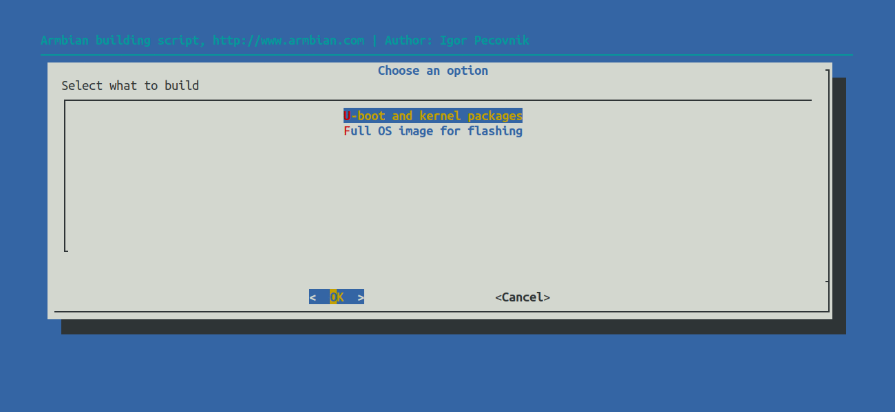

<h2 align="center">
  <a href=#></a>
  <br><br>
</h2>

# Armbian Linux Build Framework

## Purpose of This Repository

This repository contains the **Armbian Linux build framework** — the scripts, configurations, patches, and packaging recipes used to produce customizable Debian- and Ubuntu-based OS images for single-board computers (SBCs) and other embedded devices.

It builds a complete Linux system (kernel, bootloader, root filesystem) with full control over versions, device trees, firmware, extensions and system tuning, across multiple CPU architectures.

> **Looking for prebuilt images?** Use [Armbian Imager](https://github.com/armbian/imager/releases) — the easiest way to download and flash Armbian to an SD card or USB drive. Available for Linux, macOS, and Windows.

## Quick Start

```bash
git clone https://github.com/armbian/build
cd build
./compile.sh
```

<a href="#armbian-linux-build-framework"></a>

The entry point `compile.sh` sources `lib/single.sh` and dispatches to the CLI. Run it without arguments for the interactive menu, or pass command-line options (e.g. `BOARD=...`, `BRANCH=...`, `RELEASE=...`, `KERNEL_CONFIGURE=...`) to drive it non-interactively.

## Build Host Requirements

### Hardware
- **RAM:** ≥ 8 GB (less may work with `KERNEL_BTF=no`)
- **Disk:** ~50 GB free space
- **Architecture:** `x86_64`, `aarch64`, or `riscv64`

### Operating System
- **Native builds:** Armbian / Debian 13 (Trixie)
- **Containerized:** any Docker-capable Linux
- **Windows:** WSL2 with Armbian / Debian 13 (Trixie)

### Software
- Superuser privileges (`sudo` or root)
- An up-to-date host system (outdated Docker or related tooling can cause failures)

## Built With

The framework is primarily implemented in **Bash** (`compile.sh`, `lib/`, `extensions/`, board/family configs). It is complemented by:

- **Python** helpers and tooling under `tools/` and in various build steps
- **Device Tree Source** overlays and kernel-config fragments under `patch/` and `config/`
- **GNU Make** fragments (`Makefile`) for kernel overlay directories
- **YAML** for GitHub Actions workflows, issue templates, and labeler/pre-commit configuration
- An **action.yml** composite GitHub Action (`Rebuild Armbian`) for building images or kernels from CI

## Repository Layout

| Path | Contents |
|------|----------|
| `compile.sh` | Main entry point; delegates to `lib/single.sh` |
| `action.yml` | Composite GitHub Action to build Armbian from a workflow |
| `lib/` | Core build framework (functions, tools, CLI) |
| `config/` | Boards, bootenv, distributions, CLI, kernel configs, sources, … |
| `config/boards/` | Per-board configuration files (see extensions below) |
| `config/distributions/` | Supported Debian/Ubuntu release definitions |
| `config/cli/` | CLI/minimal package lists per release |
| `extensions/` | Optional, opt-in build extensions |
| `packages/` | Packaging recipes (`armbian`, `bsp`, `bsp-cli`, `bsp-desktop`, `blobs`, `extras-buildpkgs`) |
| `patch/` | Kernel, U-Boot and other patches (grouped per family / version) |
| `tools/` | Developer helper tools (e.g. `mk_format_patch`, `unifying_configs`) |
| `.github/` | Workflows, issue/PR templates, CODEOWNERS, labeler config |

### Board configuration extensions

Board configs under `config/boards/` use the file extension to express the support level:

| Extension | Meaning |
|-----------|---------|
| `.conf` | Supported |
| `.csc`  | Community maintained / unstable |
| `.eos`  | End of life |
| `.wip`  | Work in progress |
| `.tvb`  | TV box, community supported (no Armbian maintainer) |

See [`config/boards/README.md`](config/boards/README.md) for the full list of board-level build options (`BOARD_NAME`, `BOARDFAMILY`, `BOOTCONFIG`, `KERNEL_TARGET`, `MODULES`, overlays, etc.) and [`config/distributions/README.md`](config/distributions/README.md) for the upstream distribution status.

## Using the GitHub Action

This repository also ships a reusable composite action (`action.yml`, name: *Rebuild Armbian*) that checks out `armbian/build`, `armbian/os` and optional customisations, installs requirements and runs `compile.sh`.

Key inputs (see `action.yml` for the complete list) include:

| Input | Default | Purpose |
|-------|---------|---------|
| `armbian_target` | `kernel` | Build target (`image` or `kernel`) |
| `armbian_board` | `uefi-x86` | Board to build for |
| `armbian_branch` | `main` | Build framework branch |
| `armbian_kernel_branch` | `current` | Kernel branch (`legacy` / `current` / `edge` / …) |
| `armbian_release` | `noble` | Userspace release |
| `armbian_ui` | `minimal` | `minimal`, `server`, or a desktop environment |
| `armbian_compress` | `sha,img,xz` | Output compression / artifacts |
| `armbian_extensions` | *(empty)* | Space-separated list of extensions to enable |

PGP signing, artifact upload, release tagging and an index/base URL for publishing are also supported via dedicated inputs.

## Continuous Integration

The repository's GitHub Actions pipelines (data sync, maintenance, security scans, artifact builds, mirroring, etc.) are documented and tracked in a dedicated overview rather than in this README:

➡️ **[CI overview for `armbian/build`](https://actions.armbian.com/?repo=build)**

Self-hosted runner setup notes used by the Armbian infrastructure are kept in [`.github/workflows/README.md`](.github/workflows/README.md).

## Contributing

Contributions of all sizes are welcome — bug reports, documentation fixes, new boards, patches, and features. Please read:

- [CONTRIBUTING.md](CONTRIBUTING.md) — how to report issues, prepare patches and submit pull requests
- [.github/CODE_OF_CONDUCT.md](.github/CODE_OF_CONDUCT.md)
- [CREDITS.md](CREDITS.md)

PRs are automatically labeled by size and category and routed to the appropriate reviewers via `CODEOWNERS`.

## Resources

- **Documentation:** <https://docs.armbian.com/Developer-Guide_Overview/>
- **Website:** <https://www.armbian.com>
- **Blog:** <https://blog.armbian.com>
- **Forums:** <https://forum.armbian.com>

## Support

- **Community forums:** [forum.armbian.com](https://forum.armbian.com)
- **Real-time chat (IRC / Discord):** [docs.armbian.com/Community_IRC/](https://docs.armbian.com/Community_IRC/)
- **Paid consultation / commercial support:** [armbian.com/contact](https://www.armbian.com/contact)

## License

The Armbian build framework is distributed under the **GNU General Public License, version 2**. See [LICENSE](LICENSE) for the full text. Individual components, patches and vendored sources may carry their own compatible licenses — see the headers and `README` files in the relevant subdirectories.

## Contributors

Thank you to everyone who has contributed to Armbian!

<a href="https://github.com/armbian/build/graphs/contributors">
  
</a>

## Armbian Partners

Our [partnership program](https://forum.armbian.com/subscriptions) supports Armbian's development and community. Learn more about [our Partners](https://armbian.com/partners).
