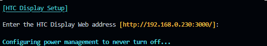
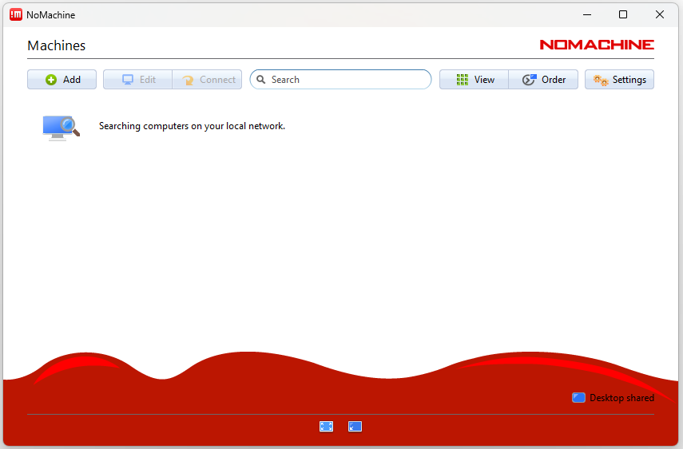

<p align="center">
  <a href="#build-framework">
  
  </a><br><br>
  <strong><font size="7">HTC DISPLAY</font></strong><br>
  <font size="4"> for AML-S905X-CC (Le Potato)</font><br>
<br><br>

## Table of contents

- [What does this project do?](#what-does-this-project-do)
- [Download prebuilt images](#download-prebuilt-images)
- [Building the image](#building-the-image)
- [Customised Components](#customised-components)
- [Project structure](#project-structure)
- [Support](#support)
- [Contact](#contact)
- [License](#license)

## What does this project do?

- Performs as a client to the HTC Display system which provides alert notifications from nurse call systems in medical facilities,
- Provides a user experience to set up the running system, install additional packages, remove unwanted software, configure the system, and more,
- Includes a set of scripts to build a custom kernel, Debian or Ubuntu based rootfs, U-boot bootloader and a set of scripts to create a bootable SD card image,

## Download prebuilt images

### Supported boards

Libre Computer - [AML-S905X-CC (Le Potato)](https://libre.computer/products/aml-s905x-cc/)

### Releases

- released **supported** builds —  <https://github.com/slamb2k/build/releases>
- upon code change **unsupported** development builds —  <https://github.com/slamb2k/build/releases>


<br/>

## Building the image

As this is a customised version of Armbian, the build process is the same as for Armbian. Please refer to the [Armbian build documentation](https://github.com/armbian/build) for more information.

## Installation and usage

To install image on a supported LePotato single board computer (SBC), download an image from [Releases](https://github.com/slamb2k/build/releases) and use a tool such as [BalenaEtcher](https://etcher.balena.io/#download-etcher) to write the image to a suitable SD Card.

Once the image is written, insert the SD Card into the SBC and power it on. The system will detect that this is the first run and start an initialisation process

Enter a strong password for the root user and then confirm it. Remember this password for future use.


The htc user will be the operational user and requires another strong password. Use something you will remember as this as it will be the password used to access the device locally or remotely.


If a network connection is not found or wireless is being used, configure the wireless network and continue.


Once the network is connected, use the IP address connected to determine and install locales.


Depending on the configuration of your LAS Server, either enter a specific IP address and port where the HTC Display Server is running or simply hit enter to use the default address.



Power management will be configured to keep the device on at all times and NoMachine NX Server will be installed/activated.

Finally, the device will be rebooted and will login automatically to XFCE where a chromium window running in kiosk mode will display the HTC Display Server.

## Customised Components

Any components customised from the official Armbian build are listed below.

Component | Description
|:--|:--
| User Creation | - Automatic creation of user `htc`
| Initial Startup Wizard | - Allows specification of `root` password<br>- Allows specification of `htc` password<br>- Wifi Connection Manager<br>- Timezone/Local Customization<br>- HTC Display Url Configuration<br>- NoMachine Free Server Installation/Configuration
| Auto-login | - Automatic login to desktop as user `htc`
| Auto-start | - Automatic start of browser in kiosk mode<br>- Automatic hiding of mouse cursor after 2 second idle time.


## Project structure

The Armbian build system folder structure is shown below and any directories or files customised from the official Armbian build are marked with a `*`.

<br>
<details><summary>Expand</summary>

```text
├── cache                                Work / cache directory
│   ├── aptcache                         Packages
│   ├── ccache                           C/C++ compiler
│   ├── docker                           Docker last pull
│   ├── git-bare                         Minimal Git
│   ├── git-bundles                      Full Git
│   ├── initrd                           Ram disk
│   ├── memoize                          Git status
│   ├── patch                            Kernel drivers patch
│   ├── pip                              Python
│   ├── rootfs                           Compressed userspaces
│   ├── sources                          Kernel, u-boot and other sources
│   ├── tools                            Additional tools like ORAS
│   └── utility
├── config                               Packages repository configurations
│   ├── targets.conf                     Board build target configuration
│   ├── boards                           Board configurations
│   ├── bootenv                          Initial boot loaders environments per family
│   ├── bootscripts                      Initial Boot loaders scripts per family
│   ├── cli                              CLI packages configurations per distribution
│   ├── desktop                          Desktop packages configurations per distribution
│   ├── distributions                    Distributions settings
│   ├── kernel                           Kernel build configurations per family
│   ├── sources                          Kernel and u-boot sources locations and scripts
│   ├── templates                        User configuration templates which populate userpatches
│   └── torrents                         External compiler and rootfs cache torrents
├── extensions                           Extend build system with specific functionality
├── lib                                  Main build framework libraries
│   ├── functions
│   │   ├── artifacts
│   │   ├── bsp
│   │   ├── cli
│   │   ├── compilation
│   │   ├── configuration
│   │   ├── general
│   │   ├── host
│   │   ├── image
│   │   ├── logging
│   │   ├── main
│   │   └── rootfs
│   └── tools
├── output                               Build artifact
│   └── deb                              Deb packages
│   └── images                           Bootable images - RAW or compressed
│   └── debug                            Patch and build logs
│   └── config                           Kernel configuration export location
│   └── patch                            Created patches location
├── packages                             Support scripts, binary blobs, packages
│   ├── blobs *                          Wallpapers, various configs, closed source bootloaders
│   ├── bsp-cli                          Automatically added to armbian-bsp-cli package
│   ├── bsp-desktop                      Automatically added to armbian-bsp-desktopo package
│   ├── bsp                              Scripts and configs overlay for rootfs
│   └── extras-buildpkgs                 Optional compilation and packaging engine
├── patch                                Collection of patches
│   ├── atf                              ARM trusted firmware
│   ├── kernel                           Linux kernel patches
|   |   └── family-branch                Per kernel family and branch
│   ├── misc                             Linux kernel packaging patches
│   └── u-boot                           Universal boot loader patches
|       ├── u-boot-board                 For specific board
|       └── u-boot-family                For entire kernel family
├── tools                                Tools for dealing with kernel patches and configs
└── userpatches                          User: configuration patching area
    ├── lib.config                       User: framework common config/override file
    ├── config-default.conf              User: default user config file
    ├── customize-image.sh *             User: script will execute just before closing the image
    ├── atf                              User: ARM trusted firmware
    ├── kernel                           User: Linux kernel per kernel family
    ├── misc                             User: various
    ├── u-boot                           User: universal boot loader patches
    └── overlay *                        User: additional files and customisations

```
</details>

## Administration

When first run, a NoMachine server instance will be configured to allow ongoing administration of the device. In order to manage the devices, please download the [NoMachine Installer](https://downloads.nomachine.com/) for the OS of the machine being used to administrator the LePotato devices. When the NoMachine client is opened, it will automatically search for nearby devices:



Any devices on the same network will automatically be displayed:


When first connecting to a device you will received a comfirmation of the host identification. Select OK to confirm and the choice will be remembered for further connections.


When asked for user credentials, enter `htc` as the username and the password configuration when the device was first initialised. Save the password in the connection file and always login using this method.


After some initial instrctional screens which can be dismissed for further connections, you will be presented with a remote control window showing the current XFCE session.


## Contact

Coming soon.

## License

Coming soon.
