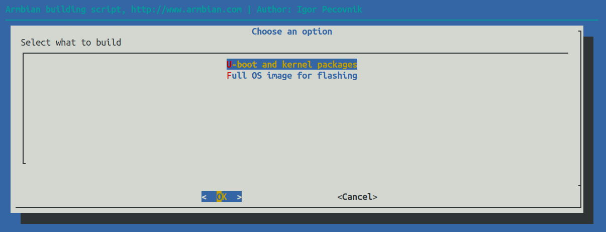

<p align="center">
  <h3 align=left><a href="#build-framework">
  
  </a>
<br>
</h3>

## What does Armbian linux build framework do?

- Builds a lightweight Linux system derived from **Debian or Ubuntu**, tailored for **low-resource hardware**
- Includes filesystem generation, low-level control tools, kernel image, and **bootloader** compilation  
- Provides a **consistent user experience** by maintaining system standards across diverse platforms
 
### Quick Start

```bash
git clone https://github.com/armbian/build
cd build
./compile.sh
```
Documentation: <https://docs.armbian.com/Developer-Guide_Overview/>

<a href="#how-to-build-an-image-or-a-kernel"></a>

### Build Host Requirements

- **Supported Architectures:** `x86_64`, `aarch64`, `riscv64`
- **System:** VM, container, or bare-metal with:
  - **≥ 8GB RAM** (less if not using BTF)
  - **~50GB disk space**
- **Operating System:**
  - Armbian / Ubuntu 24.04 (Noble) for native builds
  - Any Docker-capable Linux for containerized setup
- **Windows:** Windows 10/11 with WSL2 running Armbian / Ubuntu 24.04
- **Access:** Superuser rights (`sudo` or `root`)
- **Important:** Keep your system up-to-date — outdated tools (e.g., Docker) can cause issues.

## Download Prebuilt Images

<https://www.armbian.com/download>

## Contribute

We always need those volunteering positions:

- [Code reviewer](https://forum.armbian.com/staffapplications/application/23-code-reviewer/)
- [Build framework maintainer](https://forum.armbian.com/staffapplications/application/9-build-framework-maintainer/)
- [Test Automation Engineer](https://forum.armbian.com/staffapplications/application/19-test-automation-engineer/)

Just apply and follow!

## Support

For commercial or prioritized assistance:
 - Book an hour of [professional consultation](https://calendly.com/armbian/consultation)
 - Consider becoming a [project partner](https://forum.armbian.com/subscriptions/)
 - [Contact us](https://armbian.com/contact)!

Free support:

 Find free support via [general project search engine](https://www.armbian.com/search), [documentation](https://docs.armbian.com), [community forums](https://forum.armbian.com/) or [IRC/Discord](https://docs.armbian.com/Community_IRC/). Remember that our awesome community members mainly provide this in a **best-effort** manner, so there are no guaranteed solutions.

## Contact

- [Forums](https://forum.armbian.com) for Participate in Armbian
- IRC: `#armbian` on Libera.chat / oftc.net
- Matrix: [https://forum.armbian.com/topic/40413-enter-the-matrix/](https://forum.armbian.com/topic/40413-enter-the-matrix/)
- Discord: [https://discord.gg/armbian](https://discord.gg/armbian)
- Follow [@armbian](https://twitter.com/armbian) on 𝕏 (formerly known as Twitter), <a rel="me" href="https://fosstodon.org/@armbian">Mastodon</a> or [LinkedIn](https://www.linkedin.com/company/armbian).
- Bugs: [issues](https://github.com/armbian/build/issues) / [JIRA](https://armbian.atlassian.net/jira/dashboards/10000)
- Office hours: [Wednesday, 12 midday, 18 afternoon, CET](https://calendly.com/armbian/office-hours)

## Contributors

Thank you to all the people who already contributed to Armbian!

<a href="https://github.com/armbian/build/graphs/contributors">
  
</a>

### Also

- [Current and past contributors](https://github.com/armbian/build/graphs/contributors), our families and friends.
- [Support staff](https://forum.armbian.com/members/2-moderators/) that keeps forums usable.
- [Friends and individuals](https://armbian.com/authors) who support us with resources and their time.
- [The Armbian Community](https://forum.armbian.com/) helps with their ideas, reports and [donations](https://www.armbian.com/donate).

## Armbian Partners

Armbian's partnership program helps to support Armbian and the Armbian community! Please take a moment to familiarize yourself with our Partners:

- [Click here to visit our Partners page!](https://armbian.com/partners)
- [How can I become a Partner?](https://forum.armbian.com/subscriptions)

## Star History

[](https://star-history.com/#armbian/build&Date)

## License

This software is published under the GPL-2.0 License license.
